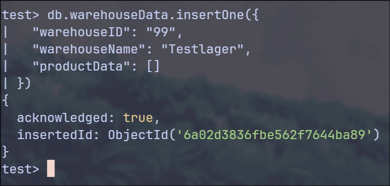
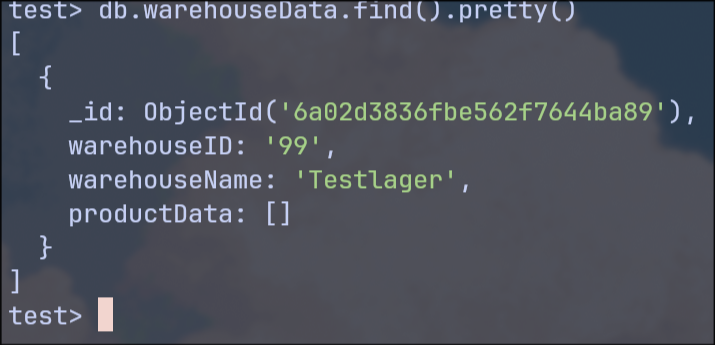
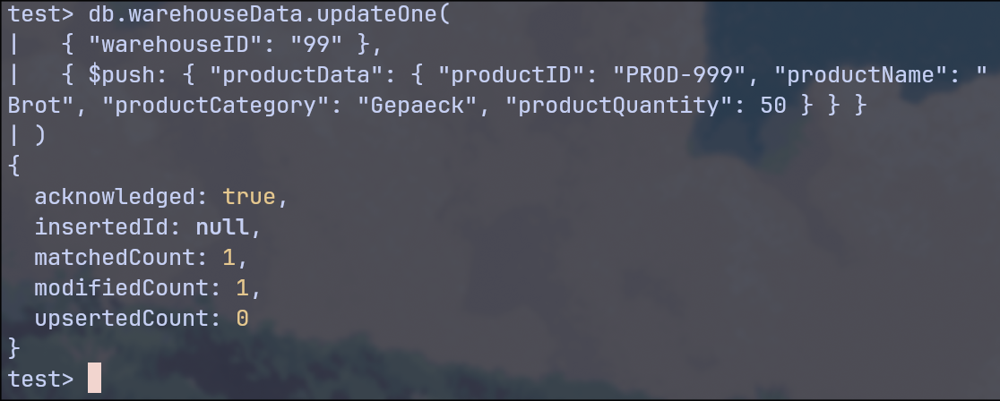
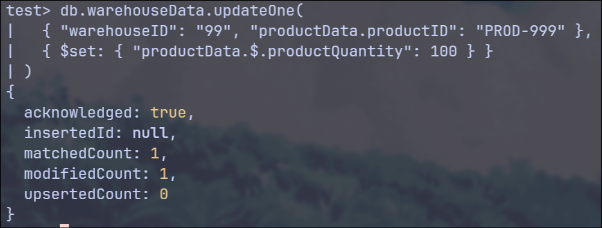
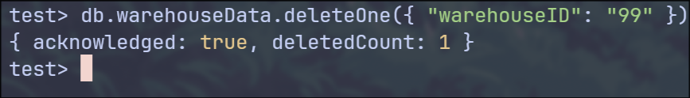
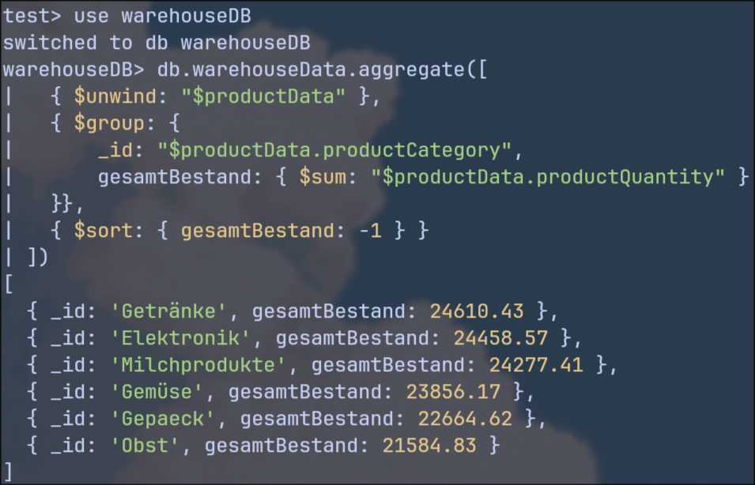
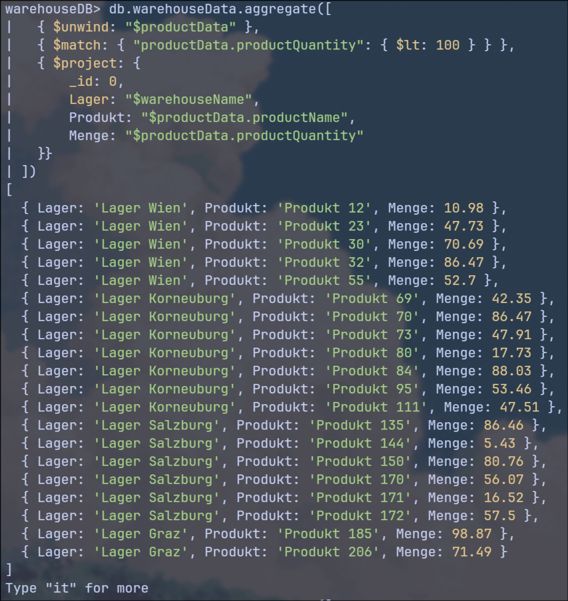
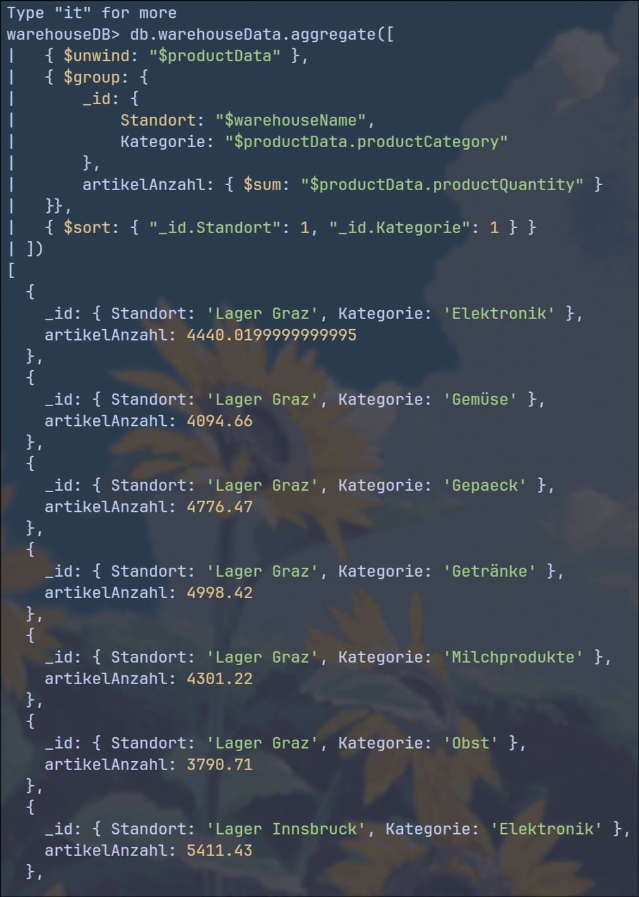

# Middleware Engineering "Document Oriented Middleware using MongoDB"

## 1. Einführung und Zielsetzung

Das Ziel dieser Übung war die Implementierung einer zentralen, dokumentenorientierten Middleware zur Verwaltung von Lagerstandsdaten mehrerer dezentraler Warenlager. Als technologischer Stack wurde **Spring Boot** in Kombination mit **MongoDB** eingesetzt. Im Fokus stand dabei der Entwurf einer geeigneten JSON-Datenstruktur, die Umsetzung einer REST-Schnittstelle sowie die Aggregation großer Datenmengen für das Berichtswesen.

## 2. Systemarchitektur & Datenmodell

In diesem Projekt wurde das **Embedded-Document-Pattern** gewählt. Anstatt Produkte und Lager in relationalen Tabellen zu trennen, werden die Produkte direkt als Liste innerhalb eines Lager-Dokuments gespeichert. Dies optimiert die Leseperformance für lagerbezogene Abfragen.

### 2.1 JSON-Datenstruktur (Beispiel)

```json
{
  "warehouseID": "1",
  "warehouseName": "Lager Wien",
  "warehouseCity": "Wien",
  "warehouseCountry": "Austria",
  "productData": [
    {
      "warehouseID": "1",
      "productID": "PROD-123",
      "productName": "Semmeln",
      "productCategory": "Gebäck",
      "productQuantity": 500.0
    }
  ]
}

```

### 2.2 Implementierungsdetails

* **Java Version:** 17 (Spring Boot 3.2.0)
* **Persistence:** `WarehouseRepository` (erweitert `MongoRepository`)
* **Controller:** `WarehouseController` stellt Endpunkte für CRUD-Operationen auf Warehouses und Produkten bereit.

## 3. Datengenerierung (Vertiefung)

Um die Anforderungen der Vertiefung zu erfüllen, wurde ein automatischer Generator in der `Application.java` implementiert. Beim Systemstart werden:

* 5 verschiedene Warenlager (Wien, Linz, Salzburg, Graz, Innsbruck) angelegt.
* Pro Lager 60 Produkte in 6 verschiedenen Kategorien generiert.
* Insgesamt 300 Dokumente bzw. Datensätze in der MongoDB persistiert.

---

## 4. Evaluierung mittels Mongo Shell

Die korrekte Funktion der Datenbank und der Middleware wurde über die `mongosh` verifiziert.

### 4.1 CRUD Operationen (Grundlagen)

Die folgenden Befehle dokumentieren die grundlegenden Datenbankoperationen:

**1. Create: Ein neues Lager manuell hinzufügen**



**2. Read: Abfrage aller Lagerstandorte**



**3. Update: Hinzufügen eines Produkts zu einem Lager**



**4. Update: Ändern einer Produktmenge**



**5. Delete: Löschen eines Test-Lagers**



### 4.2 Berichtswesen & Aggregation (Vertiefung)

Für das Management in der Zentrale wurden drei komplexe Fragestellungen mittels des MongoDB Aggregation Frameworks gelöst:

**F1: Gesamtbestand pro Produktkategorie unternehmensweit**

```javascript
db.warehouseData.aggregate([
  { $unwind: "$productData" },
  { $group: { _id: "$productData.productCategory", gesamt: { $sum: "$productData.productQuantity" } } }
])

```



**F2: Produkte mit kritischem Bestand (< 100 Stück) finden**

```javascript
db.warehouseData.aggregate([
  { $unwind: "$productData" },
  { $match: { "productData.productQuantity": { $lt: 100 } } }
])

```



**F3: Artikelanzahl pro Lagerstandort nach Kategorie**

```javascript
db.warehouseData.aggregate([
  { $unwind: "$productData" },
  { $group: { 
      _id: { 
          Standort: "$warehouseName", 
          Kategorie: "$productData.productCategory" 
      }, 
      artikelAnzahl: { $sum: "$productData.productQuantity" } 
  }},
  { $sort: { "_id.Standort": 1, "_id.Kategorie": 1 } }
])

```



---

## 5. Beantwortung der Protokollfragen

### 5.1 Vorteile eines NoSQL Repository (vs. relationales DBMS)

1. **Flexibles Schema:** Datenstrukturen können ohne komplexe Migrationen (Alter Table) angepasst werden.
2. **Performance:** Durch das Embedding von Daten entfallen teure JOIN-Operationen beim Lesen.
3. **Skalierbarkeit:** NoSQL-Datenbanken wie MongoDB lassen sich durch Sharding einfacher horizontal skalieren.
4. **Objekt-Mapping:** Die Daten werden im JSON-Format gespeichert, was direkt der Struktur in modernen Programmiersprachen entspricht (kein Impedance Mismatch).

### 5.2 Nachteile eines NoSQL Repository

1. **Datenredundanz:** Informationen werden oft mehrfach gespeichert (Denormalisierung), um JOINs zu vermeiden.
2. **Keine Standardisierung:** Es gibt kein universelles SQL; jede NoSQL-DB hat eine eigene Abfragesprache.
3. **Transaktionssicherheit:** Komplexe Transaktionen über mehrere Dokumente hinweg sind schwieriger umzusetzen als in SQL-Datenbanken.
4. **Speicherverbrauch:** Durch Redundanz und Schema-Speicherung pro Dokument ist der Speicherbedarf oft höher.

### 5.3 CAP-Theorem

Das CAP-Theorem besagt, dass ein verteiltes System nur zwei der drei Eigenschaften garantieren kann:

* **C (Consistency):** Alle Knoten sehen zum selben Zeitpunkt dieselben Daten.
* **A (Availability):** Jede Anfrage wird beantwortet (auch bei Ausfall einzelner Knoten).
* **P (Partition Tolerance):** Das System arbeitet bei Netzwerkfehlern weiter.
  MongoDB ist primär ein **CP-System** (Konsistenz und Ausfalltoleranz), da bei einem Split des Netzwerks die Konsistenz über die Verfügbarkeit gestellt wird (Election eines neuen Primaries).

---

## 6. Fazit

Die Übung demonstriert erfolgreich, wie moderne Middleware-Architekturen von der Flexibilität dokumentenorientierter Datenbanken profitieren können. Besonders die einfache Handhabung von verschachtelten Listen (Produkte in Warehouses) und die mächtigen Aggregations-Tools machen MongoDB zu einer exzellenten Wahl für dezentrale Lagersysteme.

---